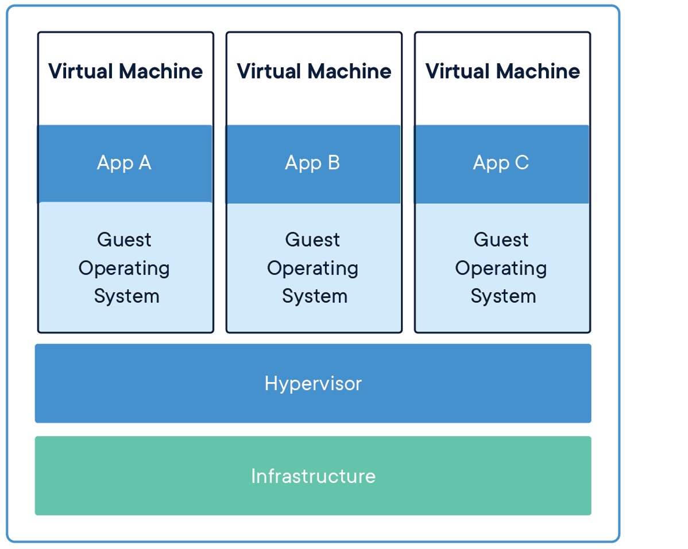
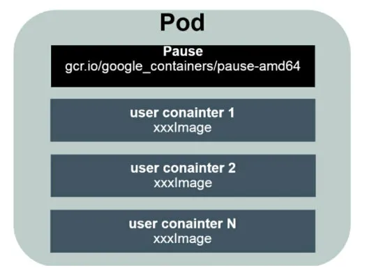

<!--
_paginate: false
_class: invert lead
-->
# Spark on Kubernetes


---
<!--
_paginate: false 
-->
# Contents

* Cloud Native Computing
* Docker and Kubernetes
* Spark on Kubernetes

---
<!--
_paginate: false
_class: lead
-->
# Cloud Native Computing

> As defined by the Cloud Native Computing Foundation (CNCF), Cloud native technologies empower organizations to build and run scalable applications in public, private, and hybrid clouds. Features such as **containers**, **service meshes**, **micro-services**, immutable infrastructure, and declarative application programming interfaces (APIs) best illustrate this approach.

---


---


---


---


---


---


---


---


---
<!--
_paginate: false 
_class: lead
-->
# Docker and Kubernetes

> **Docker** is a set of platform as a service (PaaS) products that use OS-level virtualization to deliver software in packages called containers.
> **Kubernetes** is an open-source container-orchestration system for automating computer application deployment, scaling, and management.

---



---


---
<!--
_class: lead
-->
|   特性   |    VM    |       Docker       |
| :------: | :------: | :----------------: |
| 启动速度 |  分钟级  |        秒级        |
|  CI/CD   |  :cry:   | 测试、生产环境一致 |
|   性能   |  损耗大  |     近似物理机     |
|   体积   | 较大(GB) |      极小(MB)      |
|   拓展   |  :cry:   |       跨平台       |

---
## Docker Workflow

* Image: 跨平台、可移植的程序+环境包, 基于Dockerfile制作
* Register: 镜像的存储位置，
  官方镜像仓库地址（https://hub.docker.com/）
* Container: 进行了资源隔离的镜像运行时环境


---

## Docker 实现原理

* Linux **Namespaces**: 
  * CLONE_NEWNS (mount)
  * CLONE_NEWUTS (Unix Time Sharing)
  * CLONE_NEWIPC (InterProcess Communication)
  * CLONE_NEWPID (Process ID)
  * CLONE_NEWNET
  * CLONE_NEWUSER

Clone(2)
```c
int clone(int (*fn)(void*), void *stack, int flags, void *arg);
```

---


* **CGroups** (Control Groups)
  * Limit_Cpu
  * Limit_Memory
  * Limit_IO
  
---


* **UnionFS** (Union File System)

UnionFS可以把多个目录内容联合挂载到同一个目录下，而目录的物理位置是分开的。UnionFS 可以把只读和可读写文件系统合并在一起，具有写时复制功能，允许只读文件系统的修改可以保存到可写文件系统当中。

---

## Kubernetes Concepts

* Pod
Pods are the smallest deployable units of computing that you can create and manage in Kubernetes.

* Namespaces
Kubernetes supports multiple virtual clusters backed by the same physical cluster. These virtual clusters are called namespaces.



---

## Kubernetes Features

* Service discovery and load balancing

* Automated rollouts and rollbacks 

* Automatic bin packing

* Self-healing 

* Secret and configuration management

---
## Kubernetes Architecture


---
<!--
_paginate: false
_class: lead
-->
# Spark on Kubernetes

---

## How it works


---

## Kubernetes vs Yarn

* Version and dependency control
* Isolating jobs
* Kubernetes ecosystem
---

TPC-DS is the de-facto standard benchmark for measuring the performance of decision support solutions. 

>[[AWS]Optimizing Spark performance on Kubernetes
](https://aws.amazon.com/cn/blogs/containers/optimizing-spark-performance-on-kubernetes/)


---


---
<!--
_paginate: false
_class: lead
-->
## Demo Show

---
<!--
_paginate: false
_class: invert lead
-->
# Thank You 
# For Your Attention